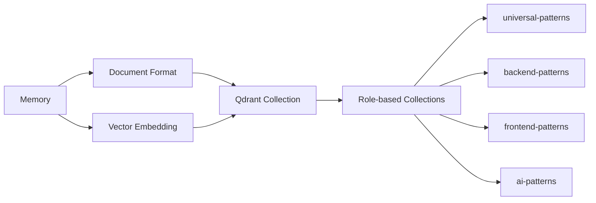
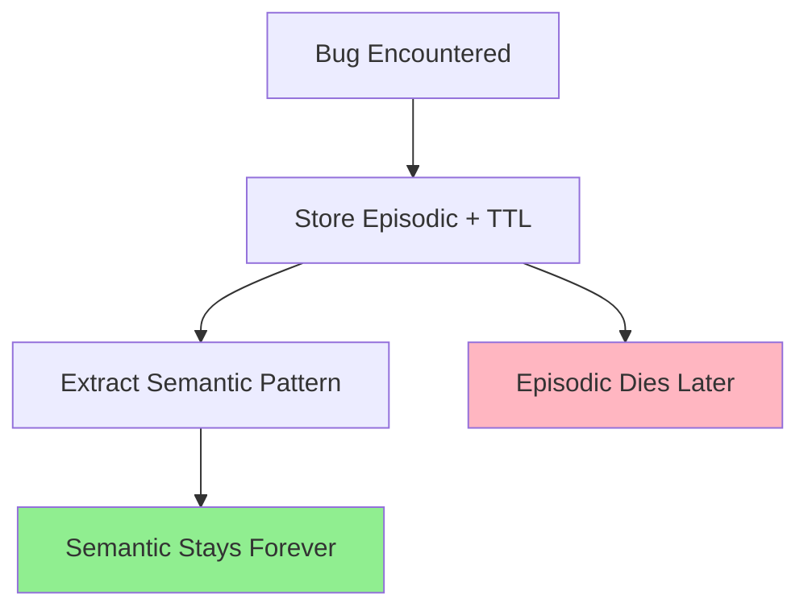
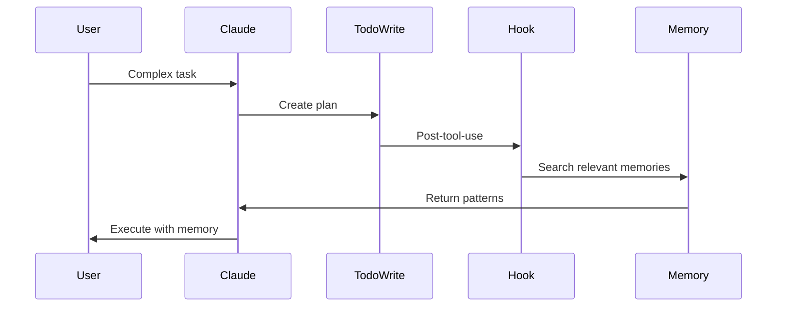
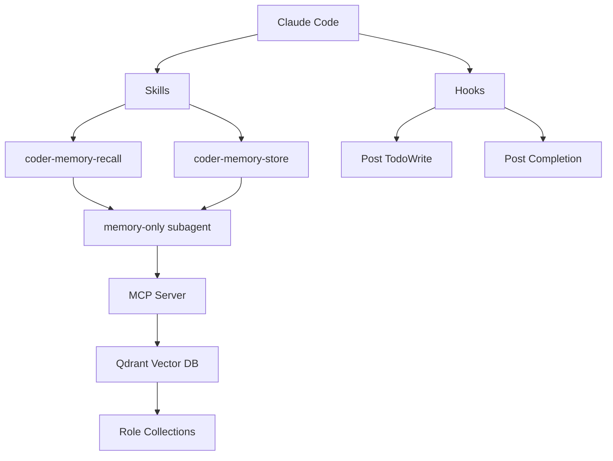

# Memory for Claude Code: A Practical Guide

**DRAFT V3**

---

## The Problem

Claude Code is brilliant but has amnesia - forgets everything daily, repeats the same bugs. Not very useful.

**Memory solves that problem.**

---

## The Solution

I've created a memory package that you can install and use directly with Claude Code. One command, everything works.

**Just want to use it?** Skip to the installation link at the end.

**Want to understand how it works?** Keep reading.

---

# How It Works (Optional)

---

## 1. How: Storage Mechanism

### Theory

People debate page indexes, tree structures, knowledge graphs. Differences of 10-20% don't matter when next year Google releases something better.

### Our Implementation

**Simple:** Files + Qdrant vector database.



**Key design:**
- MCP server (`src/qdrant_memory_mcp/__main__.py`)
- Two-stage retrieval: previews first (title + description), full content on demand
- Role-based collections: backend, frontend, AI, etc.
- In-memory embedding cache (prevents repeated API calls)

**References:**

*Papers we use:*
- **ACE: Agentic Context Engineering** (Oct 2025)
- **Reasoning Bank** (Google, Sept 2025) - test-time scaling
- **LangChain Agent Memory Paper** - episodic, semantic, procedural

*Other approaches (work but I don't care):*
- Page Index, Knowledge Graph, Hinside article on memory

---

## 2. What: Content to Store

### Theory

**First rule: Storing every specific memory is garbage and not useful.**

LangGraph defines three memory types: episodic, semantic, procedural.

### Our Implementation

**Before episodic dies, extract to semantic.** Once extracted, episodic can expire safely.



**Example flow:**

**1. Hit Binance API rate limit** → locked out for hours

**2. Store episodic (with TTL)**
```
Binance API hit rate limit of 1200 requests/minute
See file: binance_crawler.py
Tags: #backend #api #binance #rate-limit
```

**3. Extract semantic (permanent)**
```
For external APIs, always check rate limits before deployment
Tags: #backend #api #best-practice
```

**In our code:**
- Episodic: `memory_type: "episodic"` with TTL metadata
- Semantic: `memory_type: "semantic"` (no expiration)
- Procedural: `memory_type: "procedural"` (workflows)

**Skills that handle this:**
- `coder-memory-store` - auto-extracts semantic from episodic
- `coder-memory-recall` - searches both types

---

## 3. When: Trigger Conditions

### Theory

Most papers ignore "when" entirely. But in practice, it's the hardest question.

### Our Implementation

**Two triggers in Claude Code:**

#### When to STORE?

**After task completes** (end of while loop)

```python
# Conceptual - Claude Code's main loop
while not task_complete:
    use_tools()

# ← Store memory here (via hook)
```

**Implementation:**
- Hook: `~/.claude/hooks/memory_store_reminder.py`
- Triggers after task completion
- Random sampling (1/3 chance) to reduce noise

#### When to RETRIEVE?

**When planning tool is called** (`TodoWrite`)



**Why this works:**
- **Selective** - Only complex tasks call TodoWrite
- **Context-aware** - Agent knows what it needs when planning
- **Perfect timing** - Right before execution

**Implementation:**
- Skill: `coder-memory-recall` (triggered by complex tasks)
- Subagent: `memory-only` (MCP tools only, no file access)
- Hook on TodoWrite post-tool-use

**Learn more:** [Claude Code Hooks Documentation]

---

## Quick Summary

| Question | Theory | Our Implementation |
|----------|--------|-------------------|
| **How** | Files/Vector/Graph | Qdrant + MCP server + role collections |
| **What** | Episodic/Semantic/Procedural | Auto-extract semantic from episodic with TTL |
| **When (Store)** | Various approaches | After task completes (hook on completion) |
| **When (Retrieve)** | Often ignored | When TodoWrite called (complex tasks only) |

---

## Architecture Overview



**Components:**
- **MCP Server** - Memory operations via tools
- **Qdrant** - Vector database (Docker container)
- **Skills** - Auto-trigger recall/store
- **Subagent** - MCP-only (prevents file pollution)
- **Hooks** - Timing triggers

---

## Installation

**One-command install includes:**
- MCP server
- Docker + Qdrant (auto-start)
- Skills (`coder-memory-recall`, `coder-memory-store`)
- Subagent (`memory-only`)
- Configuration (`~/.claude.json`)

**Installation link:** [To be added when package is ready]

---

## Don't Over-Engineer

Memory is THE hot topic (end 2025 → biggest 2026). Anthropic has memory in beta. Google has papers on solving it at the LLM level.

**My advice:** Simple, working solutions beat complex optimizations. The big players will release model-layer memory soon.

If there's memory, coding agents transform completely. But don't waste time over-engineering.

---

## What's Next

- Installation package (one command)
- Source code release (reverse-engineered Claude Code - separate post)
- Autonomous team framework (memory is the real power)

---

**Written:** 2026-01-13
**Status:** DRAFT V3 - Added practical implementation details
